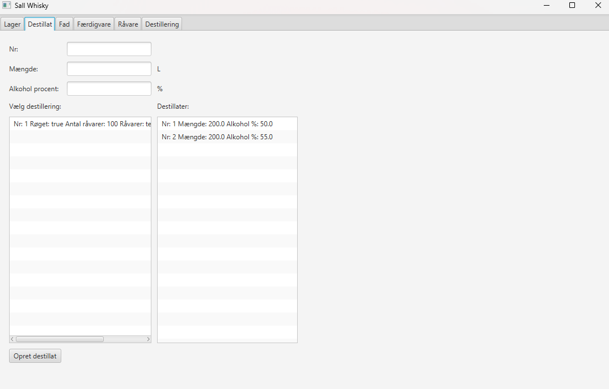
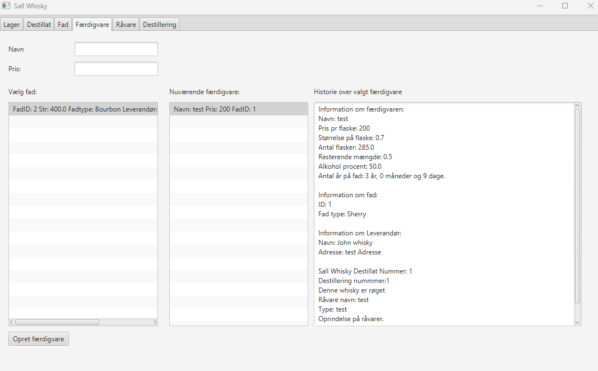
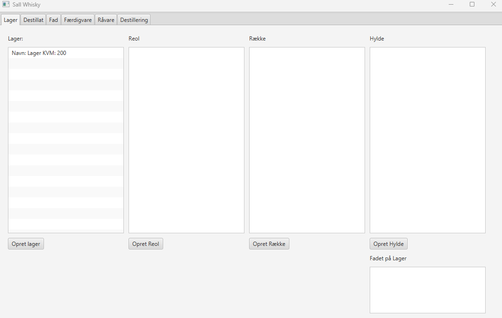

# Sal Whisky Inventory System

A Java and JavaFX application developed for managing inventory and tracking the whisky production process at Sal Whisky.

## Project Description

This project is an inventory and production management system developed for a small whisky producer.

The application models the different stages of the whisky production process and makes it possible to keep track of raw materials, distillates, barrels and finished products.

The system also includes warehouse management, allowing products and materials to be organized and tracked throughout the production process.

The project was developed as part of my studies at Erhvervsakademi Aarhus.

## Features

- Manage raw materials
- Track whisky production stages
- Manage distillates and barrels
- Manage finished products
- Warehouse management
- Track products through the production process
- Graphical user interface using JavaFX
- Unit testing

## Technologies

- Java
- JavaFX
- Object-Oriented Programming
- JUnit
- Git

## Project Structure

```text
Sal Whisky/
├── src/
│   ├── app/
│   ├── Controller/
│   ├── gui/
│   └── model/
└── test/
```

The project is structured into different areas:

- **Model** – Contains the application's data and domain classes
- **Controller** – Handles application logic and interaction between the GUI and model
- **GUI** – Contains the JavaFX user interface
- **App** – Contains the application entry point
- **Test** – Contains unit tests

## Production Flow

The system models the different stages of the whisky production process:

```text
Raw Material
     ↓
Distillation
     ↓
Distillate
     ↓
Barrel
     ↓
Finished Product
```

This makes it possible to follow the different entities throughout the production process.

## Warehouse Management

The warehouse is represented using a hierarchical structure:

```text
Warehouse
    ↓
Rack
    ↓
Row
    ↓
Shelf
```

This structure makes it possible to organize and locate products within the warehouse.

## Screenshots

Screenshots of the application are included below.

### Distillation



### Finished Product



### Warehouse



## Testing

The project includes unit tests to verify important parts of the application's functionality.

Testing was used to help ensure that the different components of the system behaved as expected.

## Project Context

This project was developed as a school project at Erhvervsakademi Aarhus.

The purpose of the project was to gain practical experience with object-oriented programming, application architecture, graphical user interfaces and testing.

The project was developed around a real-world scenario where a whisky producer needed a system for managing production and inventory.

## What I Learned

Through this project I gained experience with:

- Object-oriented programming in Java
- Developing graphical user interfaces with JavaFX
- Structuring a larger Java application
- Separating models, controllers and GUI components
- Working with collections and application data
- Implementing a production workflow
- Designing a warehouse management structure
- Writing unit tests with JUnit
- Using Git and GitHub for version control
